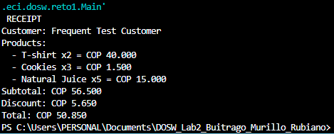

# DOSW_Lab2_Buitrago_Murillo_Rubiano
Lab2 de DOSW

Desarrollo del desafio N°1
### Desafío 1: Implementación del patrón Strategy

Para el Desafío 1 se utilizó el patrón de comportamiento **Strategy**, con el objetivo de permitir diferentes estrategias de descuento sin generar un acoplamiento directo entre el cliente y una implementación específica.

**Estructura del sistema:**

* `Product` representa cada producto y cuenta con un precio **inmutable** una vez creado.
* `CartItem` relaciona un producto con una cantidad determinada y se encarga de calcular su subtotal.
* `ShoppingCart` almacena la lista de productos agregados al carrito y calcula el total mediante **Streams**, utilizando las operaciones `map` y `reduce`.
* `DiscountStrategy` es la interfaz que establece el contrato para las estrategias de descuento. `NewCustomerDiscount` (5 %) y `FrequentCustomerDiscount` (10 %) corresponden a las implementaciones concretas. Ambas heredan de `AbstractDiscountStrategy`, clase que centraliza la validación del subtotal, con la que evitamos la duplicación de código.
* `Customer` almacena el nombre del cliente y la estrategia de descuento asignada, sin depender directamente de una implementación concreta, aplicando el principio de **Inversión de Dependencias (Dependency Inversion)**.
* `Receipt` se encarga de generar el recibo final. Para ello, utiliza `filter` y `forEach` para listar los productos, además de calcular el subtotal, el descuento y el total. Finalmente, presenta los valores con formato de miles colombiano.

Adicionalmente, en la clase `Main` se realizó directamente el ejemplo planteado en el reto, con el propósito de comprobar el correcto funcionamiento de las validaciones implementadas. También se desarrollaron **tres pruebas** para verificar el comportamiento del sistema, las cuales se encuentran descritas y documentadas dentro del archivo `.java` correspondiente.

**Estado actual del reto:** todos los requisitos funcionales y de diseño establecidos para el desafío se encuentran cumplidos.

En cuanto a las preguntas puntuales del reto:

1. **Principios SOLID:**

* **(S) Single Responsibility:** `Product` solo representa un producto con nombre y precio, `CartItem` solo representa el producto + su cantidad, calculando su propio `subTotal`, `ShoppingCart` solo recibe la lista de items y suma el total, `DiscountStrategy` se utiliza para calcular los descuentos y `Receipt` solo arma la estructura de la factura y la imprime.

* **(O) Open/Closed:** el sistema está abierto por si se desea agregar algún descuento nuevo, sin embargo, está cerrado para modificar el código ya existente. Es decir, si mañana Don Pepe decide agregar un descuento para clientes VIP, solo se debe crear la nueva clase `VipCustomerDiscount`, hacer que extienda de `AbstractDiscountStrategy` y listo.

* **(L) Liskov Substitution:** cualquier implementación que se necesite de `DiscountStrategy` se puede reemplazar sin problema, porque a `Customer` no le interesa si tiene o no un `NewCustomerDiscount`, ya que cualquier implementación cumpliría con el mismo contrato.

* **(I) Interface Segregation:** `DiscountStrategy` tiene un solo método (`calculateDiscount`). No obliga a las clases a implementar métodos que no necesitan y es una interfaz pequeña y específica.

* **(D) Dependency Inversion:** `Customer` no depende de una clase concreta de descuento, como `NewCustomerDiscount`, sino que depende de la **interfaz** `DiscountStrategy`.

 2. **Polimorfismo::** 
El código de Customer es el mismo siempre, pero el comportamiento cambia según el objeto real que tenga por dentro. Es decir, cuando Customer.calculateDiscount() llama a discountStrategy.calculateDiscount(subtotal), Java decide en tiempo de ejecución cuál implementación usar.

 3. **Encapsulamiento:**
    Todos los atributos de todas las clases son private
 4. **Inmutabilidad:**
Product es una clase final con atributos final y sin setters. Una vez creado un producto con new Product("nombre", precio), ese precio no se puede cambiar nunca. Si necesitan un producto con otro precio, tienemos que crear un Product nuevo, no modificar el existente.

Desarrollo del desafio N°2
### Desafío 2: Implementación del patrón creacional Builder
Se utilizó el patrón creacional Builder porque el reto exige construir una hamburguesa personalizada paso a paso, es decir, tener una cantidad dada de variables independientes y opcionales (pan, carne, queso, vegetales y salsas).

Este patrón nos ayuda a separar lo complejo de la construcción (crear el objeto hamburguesa) de lo que es su presentación final, permitiéndonos ensamblar el objeto incrementalmente sin necesidad de un constructor con múltiples parámetros.

Lo implementamos de la siguiente manera:

BurgerBuilder mantiene una lista interna de Ingredient y expone métodos encadenables (withBread, withMeat, addIngredient) que retornan this, permitiendo realizar llamadas fluidas (method chaining).

El método build() finaliza el proceso, creando un objeto Burger a partir de los ingredientes acumulados.

La clase Cliente actúa como quien dirige la construcción (Main), seleccionando ingredientes de un catálogo predefinido y orquestando las llamadas al builder paso a paso.

Adicionalmente, usamos un Fluent Builder, que es una versión simplificada del patrón Builder clásico, sin Director ni una interfaz separada, donde el propio BurgerBuilder construye el objeto paso a paso mediante métodos encadenados.

Lo utilizamos por las siguientes razones:

El reto no lo necesitaba, ya que cada hamburguesa es distinta según lo que el usuario elige.
Utilizamos menos clases y consideramos que implementar el Director y una interfaz separada sería sobreingeniería para este caso.

**Imagenes de funcionamiento del reto**

**pruebas exitosas**

Desarrollo del desafio N°3
### Desafío 3: Implementación del patrón Factory 

Utilizamos el patrón Factory porque el sistema necesita crear distintos tipos de vehículos (Land, Water, Air) sin que el código cliente (Dealership) conozca las clases concretas ni la lógica de construcción de cada uno. Cada familia tiene su propia lógica de especificaciones (velocidad, precio, equipo) según la categoría y el modelo, por lo que delegar la creación a una clase especializada por familia evita condicionales extensos y centraliza el conocimiento de cada catálogo.

¿Cómo lo aplicamos?

Se definió la interfaz VehicleFactory con el método createVehicle(category, model). Cada familia tiene su implementación concreta (LandVehicleFactory, WaterVehicleFactory, AirVehicleFactory), cada una con su propia tabla de especificaciones (VehicleSpec). VehicleFactoryProvider selecciona la factory correcta según la familia solicitada y delega la creación, devolviendo siempre el tipo abstracto Vehicle. El cliente (Dealership) solo interactúa con VehicleFactoryProvider, sin conocer las clases concretas.

**Imegenes que muestran que si fumciona**

**Pruebas**

Desarrollo del desafio N°4
### Desafío 4: Implementación del patrón Strategy

    
    
