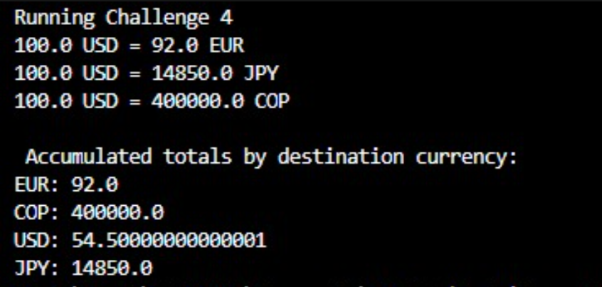

# DOSW_Lab2_Buitrago_Murillo_Rubiano
Lab2 de DOSW

Desarrollo del desafio N°1
### Desafío 1: Implementación del patrón Strategy

Para el Desafío 1 se utilizó el patrón de comportamiento **Strategy**, con el objetivo de permitir diferentes estrategias de descuento sin generar un acoplamiento directo entre el cliente y una implementación específica.

**Estructura del sistema:**

* `Product` representa cada producto y cuenta con un precio **inmutable** una vez creado.
* `CartItem` relaciona un producto con una cantidad determinada y se encarga de calcular su subtotal.
* `ShoppingCart` almacena la lista de productos agregados al carrito y calcula el total mediante **Streams**, utilizando las operaciones `map` y `reduce`.
* `DiscountStrategy` es la interfaz que establece el contrato para las estrategias de descuento. `NewCustomerDiscount` (5 %) y `FrequentCustomerDiscount` (10 %) corresponden a las implementaciones concretas. Ambas heredan de `AbstractDiscountStrategy`, clase que centraliza la validación del subtotal, con la que evitamos la duplicación de código.
* `Customer` almacena el nombre del cliente y la estrategia de descuento asignada, sin depender directamente de una implementación concreta, aplicando el principio de **Inversión de Dependencias (Dependency Inversion)**.
* `Receipt` se encarga de generar el recibo final. Para ello, utiliza `filter` y `forEach` para listar los productos, además de calcular el subtotal, el descuento y el total. Finalmente, presenta los valores con formato de miles colombiano.

Adicionalmente, en la clase `Main` se realizó directamente el ejemplo planteado en el reto, con el propósito de comprobar el correcto funcionamiento de las validaciones implementadas. También se desarrollaron **tres pruebas** para verificar el comportamiento del sistema, las cuales se encuentran descritas y documentadas dentro del archivo `.java` correspondiente.

**Estado actual del reto:** todos los requisitos funcionales y de diseño establecidos para el desafío se encuentran cumplidos.

En cuanto a las preguntas puntuales del reto:

1. **Principios SOLID:**

* **(S) Single Responsibility:** `Product` solo representa un producto con nombre y precio, `CartItem` solo representa el producto + su cantidad, calculando su propio `subTotal`, `ShoppingCart` solo recibe la lista de items y suma el total, `DiscountStrategy` se utiliza para calcular los descuentos y `Receipt` solo arma la estructura de la factura y la imprime.

* **(O) Open/Closed:** el sistema está abierto por si se desea agregar algún descuento nuevo, sin embargo, está cerrado para modificar el código ya existente. Es decir, si mañana Don Pepe decide agregar un descuento para clientes VIP, solo se debe crear la nueva clase `VipCustomerDiscount`, hacer que extienda de `AbstractDiscountStrategy` y listo.

* **(L) Liskov Substitution:** cualquier implementación que se necesite de `DiscountStrategy` se puede reemplazar sin problema, porque a `Customer` no le interesa si tiene o no un `NewCustomerDiscount`, ya que cualquier implementación cumpliría con el mismo contrato.

* **(I) Interface Segregation:** `DiscountStrategy` tiene un solo método (`calculateDiscount`). No obliga a las clases a implementar métodos que no necesitan y es una interfaz pequeña y específica.

* **(D) Dependency Inversion:** `Customer` no depende de una clase concreta de descuento, como `NewCustomerDiscount`, sino que depende de la **interfaz** `DiscountStrategy`.

 2. **Polimorfismo::** 
El código de Customer es el mismo siempre, pero el comportamiento cambia según el objeto real que tenga por dentro. Es decir, cuando Customer.calculateDiscount() llama a discountStrategy.calculateDiscount(subtotal), Java decide en tiempo de ejecución cuál implementación usar.

 3. **Encapsulamiento:**
    Todos los atributos de todas las clases son private
 4. **Inmutabilidad:**
Product es una clase final con atributos final y sin setters. Una vez creado un producto con new Product("nombre", precio), ese precio no se puede cambiar nunca. Si necesitan un producto con otro precio, tienemos que crear un Product nuevo, no modificar el existente.
    
    
    
